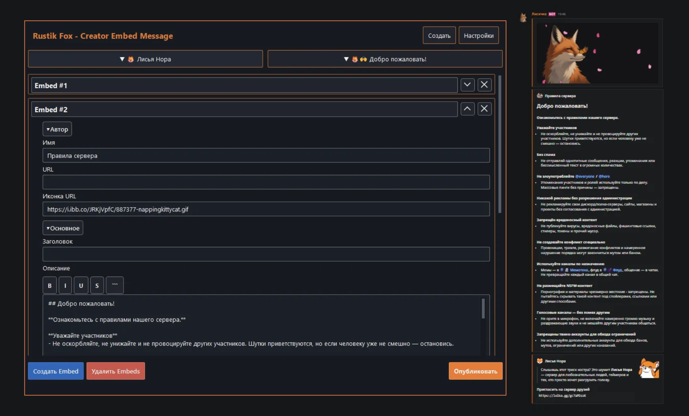

# Rustik Fox - Creator Embed Message

<p align="center">
  
</p>

[](https://lolka.gg/gc7aPDzzK)

## Установка

### Windows

1. Распакуйте архив в удобную папку.
2. Запустите `install.bat`.
3. После установки запустите `run.bat`.

Или вручную:

```powershell
py -m venv .venv
.venv\Scripts\Activate.ps1
python -m pip install -U pip
python -m pip install -r requirements.txt
python main.py
```

Требуется Python 3.8+.

## Обновление v0.1.1

- Исправлен критический краш палитры цветов: `QLinearGradient` теперь получает `QPointF`.
- Кнопки сворачивания/разворачивания Embed и удаления Embed перерисованы как аккуратные векторные иконки без проблемных шрифтовых символов.
- Экран «Настройки» приведён ближе к исходному эскизу: две основные карточки без лишних внутренних контуров вокруг текста.
- Ссылка на портал разработчиков встроена непосредственно в пояснение к токену.
- Текстовые элементы настроек принудительно очищены от рамок.
